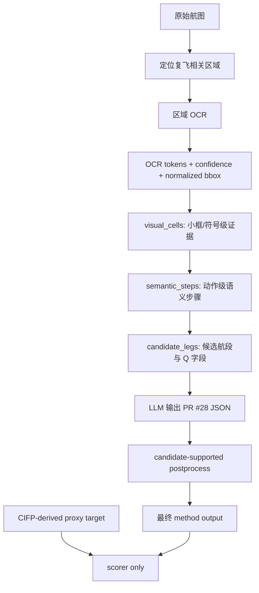

# B1/B3/B3V3 Pilot-10 汇报结果

日期：2026-04-25

## 1. 一句话结论

本次 pilot10 实验证明：相比“整图 OCR + LLM”的 B1 和“简单区域 OCR + LLM”的 B3，当前最有效的方法是 **B3V3：规则定位复飞区域 + OCR 小框证据 + semantic steps + candidate legs + LLM + candidate-supported postprocess**。

B3V3 的核心优势是：先把航图上的复飞文字、下方小框、箭头、高度、fix、radial、hold 等证据组织成接近航段的结构，再让 LLM 输出 PR #28 要求的 leg-level JSON，而不是让 LLM 直接从整图 OCR 噪声中自由猜测。

## 2. 实验目的

本实验要解决的问题是：从 FAA 进近航图中自动抽取 missed approach 复飞程序，并转成统一的 `missed_approach_leg_v1` JSON。

重点不是抽出一段自然语言，而是要做到：

1. 把复飞程序拆成多个有顺序的航段。
2. 每个航段都输出固定字段：`Q_terminator`、`Q1_fix_ident`、`Q2_altitude_constraint`、`Q3_turn`、`Q4_course_or_radial`、`Q5_hold_params`。
3. 每个字段尽量能追溯到 OCR、bbox、小框、符号或 semantic step 证据。
4. 方法输入不能泄漏 CIFP target、人工答案、chart id 等答案线索。

当前结果是 pilot10 流程验证，不是最终大规模正式实验。

## 3. 方法对比

| 方法 | 输入与处理方式 | 主要作用 | 主要问题 |
|---|---|---|---|
| B1 | 整张航图 OCR，然后交给 LLM 抽取 JSON | baseline，测试整图 OCR + LLM 的基础能力 | 整图噪声大，容易混入频率、最低标准、MSA、进近段等无关信息 |
| B3 | 先定位复飞相关区域，再 OCR + LLM | 测试区域定位是否能减少无关噪声 | 只有区域缩小还不够，小框和符号没有稳定组织成航段 |
| B3V2 | 区域 OCR + 更强候选航段提示 + LLM | 调试/诊断版本，验证 candidate legs 的价值 | 不是最严格的 no-leakage 主方案 |
| B3V3 | OCR-only visual cells + semantic steps + candidate legs + LLM + postprocess | 当前推荐主方法 | 仍受 OCR 质量和部分区域覆盖不足影响 |

## 4. B3V3 完整识别流程

## 5. 每一步具体做了什么

### Step 1：定位复飞相关区域

识别流程首先从原始航图中定位和复飞有关的区域，主要包括：

1. 顶部 `MISSED APPROACH` 文字框。
2. 平面图中的复飞轨迹和 missed approach fix 区域。
3. 下方 profile 中的复飞细节条。
4. 下方细节条内部的高度、箭头、fix、navaid、radial、track、hold 等小框元素。

这一设计的作用是减少整图 OCR 噪声。B1 直接使用整张图，容易受到无关区域干扰；B3/B3V3 先缩小到复飞区域。

### Step 2：区域 OCR 并保存证据

对复飞区域做 OCR，保存：

1. OCR 文本。
2. OCR confidence。
3. 归一化 bbox。
4. OCR token 所属区域类型。

这一步不是只为了给 LLM 文本，还为了后续人工检查和 evidence trace。每个字段后续可以追溯到某个小框或 OCR token。

### Step 3：生成 visual_cells

B3V3 不直接把一堆 OCR token 交给 LLM，而是先把小框和 OCR token 整理成 `visual_cells`。

visual cell 尽量对应一个可解释视觉单元，例如：

1. `3000`、`8700`、`11000` 这类高度。
2. 直箭头或弯箭头。
3. `MUDRE INT`、`ZEXEL`、`EVVIS` 这类 fix。
4. `R-243`、`R-350 outbound`、`tr 284`、`hdg 063` 这类 course/radial/track。
5. holding pattern 或 hold fix。

这一层解决的是“航图上有哪些符号和文字”的问题。

### Step 4：生成 semantic_steps

`semantic_steps` 把 visual cells 进一步整理成动作级步骤，例如：

1. climb to 2900。
2. left turn to 6000。
3. outbound on COE R-350。
4. left turn to 6500。
5. inbound on COE R-350。
6. hold at COE。

这一层解决的是“这些符号组合起来表示飞机做什么”的问题。它比 OCR token 更接近飞行程序逻辑。

### Step 5：生成 candidate_legs

`candidate_legs` 是 B3V3 最关键的中间层。它把 semantic steps 组织成接近 CIFP/ARINC 的候选航段，并为每个航段生成 Q 字段候选。

每个 candidate leg 包含：

1. 航段顺序 `leg_index`。
2. `Q_terminator` 候选，例如 CA、DF、TF、CF、FA、HM。
3. fix/navaid。
4. 高度约束。
5. 转弯方向。
6. heading、track、radial、inbound/outbound。
7. hold 参数。

这一步解决的是“哪个字段属于哪个航段”的问题，也是 B3V3 明显优于 B3 的主要原因。

### Step 6：LLM 结构化输出

LLM 的输入不再是杂乱 OCR，而是整理后的证据包。prompt 明确要求：

1. 只使用提供的 OCR/visual evidence。
2. 不使用 airport、chart id、procedure name、CIFP 或外部知识。
3. 证据不足时输出 `unknown` 或 `not_observable`。
4. 输出必须符合 PR #28 的 JSON 字段结构。

这一设计减少了 LLM 乱猜，也让输出更接近实验 schema。

### Step 7：candidate-supported postprocess

LLM 输出后，B3V3 使用 OCR-derived candidate legs 做后处理。它不是人工改答案，也不读取 target，而是用方法自身生成的候选航段约束明显错误。

主要作用：

1. 对齐航段数量。
2. 对齐航段顺序。
3. 防止 LLM 把一个格子或一个动作拆成多个额外航段。
4. 当 candidate leg 中某些字段有明确证据时，保持字段一致。

这一层对最终效果提升非常明显，尤其是减少 `extra_pred_legs` 和航段顺序错误。

## 6. 关键专门设计

| 专门设计 | 解决的问题 | 对结果的影响 |
|---|---|---|
| 区域 OCR | 整图 OCR 噪声太多 | 减少无关文字进入 LLM |
| visual_cells | OCR token 太碎，符号缺少结构 | 把小框、箭头、fix、radial 变成可解释单元 |
| semantic_steps | 视觉元素没有动作语义 | 把符号组合成 climb、turn、radial、hold 等动作 |
| candidate_legs | 字段不知道属于哪个航段 | 让输出更接近 PR #28 leg-level JSON |
| scalar Q_terminator | 多候选 terminator 让 LLM 摇摆 | 显著提高 `Q_terminator` 稳定性 |
| 高度 carry-forward | 高度可能作用于后续 leg | 减少高度字段漏标或错放 |
| radial inbound/outbound 判断 | `R-xxx` 需要判断方向 | 改善 `Q4_course_or_radial` |
| hold 参数收紧 | 避免把 MSA `25 NM` 误当 hold distance | 降低 false positive |
| no-leakage prompt | 防止靠 chart id 或 target 猜答案 | 保证实验有效性 |
| candidate-supported postprocess | LLM 容易多拆航段、顺序错 | 提升 leg count、顺序和字段一致性 |

## 7. 实验结果

| Method | Coverage | LegCountAcc | QFieldAcc | Precision | Recall | F1 | ChartExact |
|---|---:|---:|---:|---:|---:|---:|---:|
| B1 | 1.000 | 0.500 | 0.495 | 0.560 | 0.451 | 0.500 | 0.000 |
| B3 | 1.000 | 0.200 | 0.344 | 0.422 | 0.310 | 0.357 | 0.000 |
| B3V2 | 1.000 | 0.800 | 0.484 | 0.621 | 0.522 | 0.567 | 0.000 |
| B3V3 | 1.000 | 0.900 | 0.887 | 0.949 | 0.823 | 0.882 | 0.200 |

B3V3 字段级准确率：

| Field | Accuracy |
|---|---:|
| Q_terminator | 0.968 |
| Q1_fix_ident | 0.968 |
| Q2_altitude_constraint | 0.871 |
| Q3_turn | 0.935 |
| Q4_course_or_radial | 0.742 |
| Q5_hold_params | 0.839 |

## 8. 结果解读

B1 的 `QFieldAcc = 0.495`，说明整图 OCR + LLM 有一定能力，但受噪声影响明显。

B3 的 `QFieldAcc = 0.344`，说明只做区域定位还不够。如果没有把小框和符号组织成航段，LLM 仍然容易误拆、漏字段或混淆字段关系。

B3V2 的 `LegCountAcc = 0.800`，说明 candidate legs 对航段结构很有帮助，但它更偏调试/诊断版本。

B3V3 的 `QFieldAcc = 0.887`、`F1 = 0.882`、`LegCountAcc = 0.900`，说明“区域证据 -> visual cells -> semantic steps -> candidate legs -> LLM -> postprocess”这条路线最稳定。

## 9. 为什么 B3V3 效果最好

B3V3 好的根本原因是把任务拆成了多个可控子问题：

1. 先用区域定位减少无关噪声。
2. 再用 visual cells 保留小框和符号证据。
3. 再用 semantic steps 表达动作逻辑。
4. 再用 candidate legs 对齐航段结构。
5. 最后让 LLM 做 schema 化输出。
6. 输出后再用 OCR-derived candidates 约束明显结构错误。

这相当于把 LLM 从“直接理解整张复杂航图”降级为“根据已经整理好的证据生成规范 JSON”。任务难度明显降低，所以结果更好。

## 10. 当前局限

当前 B3V3 仍有几类错误：

1. `Q4_course_or_radial` 仍是最弱字段，主要因为 heading、track、radial、inbound/outbound 容易混淆。
2. `Q5_hold_params` 仍受 missed approach fix inset OCR 质量影响。
3. 部分初始高度或 course 需要 profile/minima/runway-course 附近上下文，当前 crop 覆盖还不够。
4. 个别图的图面自然语言分段和 CIFP 编码粒度不完全一致，会影响 exact scoring。

## 11. 下一步建议

后续优化优先级：

1. 扩展 B3V3 OCR crop，加入 missed approach fix inset、profile/minima、runway-course 附近上下文。
2. 提高 radial/track/heading 的解析规则，尤其是 inbound/outbound。
3. 强化 hold 参数提取，重点处理 inbound course、turn direction、leg distance/time。
4. 准备 B2 gold text，对比“去掉 OCR 错误后 LLM 结构化能力上限”。
5. 扩展到 100 张，并加入 bootstrap 置信区间。
6. 将人工校准平台与 evidence trace 打通，让人工能直接检查“字段来自哪个航段、哪个框、哪个 OCR token”。

## 12. 汇报结论

本阶段 pilot10 的主要结论是：**复飞抽取不能只依赖整图 OCR 或 LLM 直接推理，必须先把航图证据结构化。**

B3V3 通过区域 OCR、视觉小框、semantic steps、candidate legs 和后处理，把复杂航图识别问题拆成多个可控步骤，因此在 pilot10 中取得了当前最好结果。后续正式实验应以 B3V3 为主线继续扩展样本、完善 OCR 区域覆盖，并重点优化 course/radial 和 hold 参数字段。
