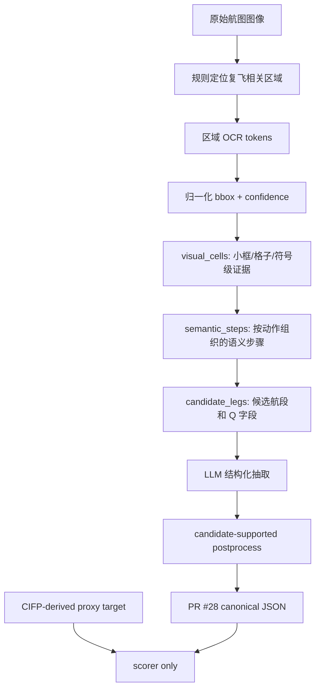

# B1/B3/B3V3 Pilot-10 方法汇报总结

日期：2026-04-25

本文档用于汇报当前 B 组 pilot10 实验的方法设计、执行流程、输入输出、评估方式和阶段性结论。它配合 `docs/b3v3_region_ocr_pilot10.md` 和 `results/pilot_10/b3v3_region_ocr_20260425/` 使用。

## 1. 当前实验要回答什么问题

本实验关注 FAA 进近航图中的 missed approach 复飞程序，目标是从航图自动抽取为统一的 leg-level JSON。输出格式严格使用 PR #28 确定的 `missed_approach_leg_v1` schema。

核心问题不是“LLM 能不能看图说出一段文字”，而是：

1. 能否把复飞程序拆成和 CIFP-derived proxy JSON 对齐的多个航段。
2. 能否对每个航段输出固定字段：`Q_terminator`、`Q1_fix_ident`、`Q2_altitude_constraint`、`Q3_turn`、`Q4_course_or_radial`、`Q5_hold_params`。
3. 能否保留 OCR、bbox、visual cell、semantic step、candidate leg 等中间证据，方便人工检查和错误分析。
4. 能否避免把 CIFP target、人工答案、chart_id 隐藏答案等信息泄漏给抽取方法。

当前完成的是 pilot10 流程验证，不是最终 100/300 张正式实验。

## 2. 方法总览

当前比较了 B1、B3、B3V2、B3V3 四个方法。B2 按 issue 定义应为 gold text + LLM，但因为人工校正 gold text 尚未准备，所以未执行。

| 方法 | 核心输入 | 作用 | 当前定位 |
|---|---|---|---|
| B1 | 整张航图 OCR 文本 + LLM | baseline，观察整图 OCR 噪声下的结构化能力 | 已执行 |
| B3 | 规则定位复飞相关区域 + OCR + LLM | 测试区域感知 OCR 是否减少无关噪声 | 已执行 |
| B3V2 | region OCR + 更强候选航段提示 + LLM | 调试/诊断版本，帮助理解候选航段价值 | 已执行，不作为 strict 主方案 |
| B3V3 | OCR-only region-aware semantic candidates + LLM + candidate-supported postprocess | 当前推荐主路线 | 已执行 |

当前结果显示，B3V3 明显优于 B1/B3/B3V2，因此它是目前应重点汇报和继续扩展的方法。

## 3. B3V3 的完整流程

### Step 1：准备样本和评分目标

输入包括 10 张 pilot 航图，以及从 CIFP 转换得到的 canonical proxy target。target 只用于评分，不能进入 OCR、prompt 或 LLM 输入。

当前 pilot10 覆盖了不同复飞模式，例如：

1. 爬升到高度后 direct fix and hold。
2. 爬升后转弯到某个 fix。
3. 沿 VOR radial outbound/inbound。
4. profile 下方复飞细节条包含多个格子的复杂图。
5. 图上文字与 CIFP leg 表达粒度不完全一致的特殊样本。

### Step 2：B1 整图 OCR baseline

B1 直接对整张航图 OCR，然后把 OCR 文本交给 LLM 输出 JSON。

B1 的优点是简单，几乎不需要先验区域规则。缺点是整图包含大量非复飞信息：频率、最低标准、机场图、MSA、进近航段、备注等。LLM 容易把无关文字混入复飞程序，导致航段数、turn、radial、hold 等字段错误。

B1 的作用是作为 baseline，证明如果不做复飞区域定位，OCR 噪声会显著影响结构化抽取。

### Step 3：B3 区域 OCR 方法

B3 先用规则找到复飞相关区域，再对这些区域 OCR。重点区域包括：

1. 顶部 `MISSED APPROACH` 文字框。
2. 平面图中复飞轨迹相关区域。
3. 下方 profile 里的复飞细节条。
4. 下方细节条内部的小框、箭头、高度、fix、radial、track、hold 等视觉元素。

B3 的设计动机是减少整图 OCR 噪声。但早期 B3 仍有两个问题：

1. 区域 OCR 虽然减少噪声，但还没有稳定地把视觉元素组织成航段。
2. 小框候选比较碎，LLM 可能把一个格子或一个符号误拆成单独航段。

因此 B3 的分数低于预期，后续发展出 B3V2/B3V3。

### Step 4：B3V3 的 visual_cells

B3V3 不直接把一堆 OCR token 扔给 LLM，而是先把 OCR token 和小框位置组织为 `visual_cells`。

每个 visual cell 尽量对应航图下方复飞细节条中的一个可解释元素，例如：

1. 高度：`3000`、`8700`、`11000`。
2. 爬升箭头：直箭头、弯箭头。
3. fix / navaid：`MUDRE INT`、`ALS`、`ZEXEL`、`EVVIS`。
4. radial / course / track：`R-243`、`R-350 outbound`、`tr 284`、`hdg 063`。
5. holding：hold fix、hold direction、hold distance 等。

visual cell 保存 OCR 文本、confidence、归一化 bbox、cell 类型和证据来源，方便追溯。

### Step 5：从 visual_cells 到 semantic_steps

`semantic_steps` 是 B3V3 的关键中间层。它把碎片化小框证据整理为“动作步骤”，例如：

1. climb to 2900。
2. climbing left turn to 6000。
3. outbound on COE R-350。
4. left turn to 6500。
5. inbound on COE R-350。
6. hold at COE。

这样做的原因是 CIFP-derived target 也是 leg-level 的。只有把视觉元素先组织为有顺序的步骤，LLM 才更不容易把字段顺序、航段数和航段关系搞乱。

### Step 6：从 semantic_steps 到 candidate_legs

`candidate_legs` 把 semantic steps 进一步整理成候选航段，并为每个航段生成 Q 字段提示。

每个候选 leg 尽量包含：

1. `leg_index`：航段顺序。
2. `Q_terminator`：候选 ARINC path terminator，例如 CA、DF、VA、VI、TF、HM 等。
3. `Q1_fix_ident`：fix 或 navaid。
4. `Q2_altitude_constraint`：高度约束。
5. `Q3_turn`：左转、右转、无转弯、hold 方向等。
6. `Q4_course_or_radial`：heading、track、course、radial、outbound/inbound。
7. `Q5_hold_params`：holding fix、inbound course、turn direction、distance 等。

B3V3 后续修复的重点之一，就是让 candidate leg 只给 scalar preferred `Q_terminator`，而不是给一堆宽泛备选，避免 LLM 在 terminator 上摇摆。

### Step 7：LLM 结构化抽取

LLM 输入包括 OCR-derived evidence、visual cells、semantic steps 和 candidate legs。LLM 的任务是把这些证据组织成 PR #28 JSON。

prompt 的关键约束：

1. 必须输出合法 JSON。
2. 字段状态只能是 `present`、`not_applicable`、`not_observable`、`unknown`。
3. 证据不足时允许输出 `unknown` 或 `not_observable`，不能硬猜。
4. 不得使用 target、expected value、人工答案或 chart_id 隐藏线索。

### Step 8：candidate-supported postprocess

LLM 输出后，B3V3 增加了一个候选支持的 postprocess。它不是人工改答案，而是用 OCR-derived candidate legs 约束明显的结构错误。

主要作用：

1. 对齐 leg order 和 leg count，减少 LLM 把一个动作拆成多个额外航段。
2. 当 candidate leg 中某些 Q 字段有明确 OCR/visual evidence 时，用这些证据保持字段一致。
3. 避免引入没有证据支持的“答案形规则”。

这一层是当前 B3V3 大幅提升的重要原因之一。

## 4. 当前做过的关键修复

在最后一轮 B3V3 实验中，流程层面做了这些修复：

1. 将 path terminator 提示从多候选改为 scalar preferred value。
2. 增加 candidate-leg postprocess，使 leg order、leg count 与 OCR-derived candidates 对齐。
3. 加强 OCR 容错，例如 `climbing 1 1000` 识别为 `11000`，`left rn` 识别为 left turn。
4. 合并被 OCR 拆开的 `tr 284 to TELLE` 这类 track/fix 表达。
5. 收紧 hold distance 提取，避免把 MSA 的 `25 NM` 当作 missed approach hold distance。
6. 删除过宽的 reciprocal-course fallback，因为它会从无关文字中产生错误 inbound course。

这些改动都发生在自动生成流程中，没有直接手工修改最终 JSON 答案。

## 5. 评估方法

评分目标是 CIFP-derived proxy JSON。评分时按 `leg_index + Q field` 对齐，比较 method output 与 proxy target。

当前报告的主要指标：

1. `Coverage`：是否每张图都有输出。
2. `LegCountAcc`：预测航段数是否等于 proxy target。
3. `QFieldAcc`：所有 leg/Q 字段的准确率。
4. `Precision / Recall / F1`：字段级抽取的查准、查全和综合表现。
5. `ChartExact`：整张图所有 leg 和字段都正确的比例。
6. `ExtraPredLegs / MissingPredLegs`：多预测或少预测的航段数。
7. Per-Q Accuracy：分别看 `Q_terminator`、fix、高度、转弯、course/radial、hold。
8. Error breakdown：wrong value、false positive、false negative、status mismatch。

数值类 course/radial 使用小容差比较，避免因为 `063` 与 `063.3` 这类显示四舍五入造成误判。

## 6. 当前结果

| Method | Coverage | LegCountAcc | QFieldAcc | Precision | Recall | F1 | ChartExact |
|---|---:|---:|---:|---:|---:|---:|---:|
| B1 | 1.000 | 0.500 | 0.495 | 0.560 | 0.451 | 0.500 | 0.000 |
| B3 | 1.000 | 0.200 | 0.344 | 0.422 | 0.310 | 0.357 | 0.000 |
| B3V2 | 1.000 | 0.800 | 0.484 | 0.621 | 0.522 | 0.567 | 0.000 |
| B3V3 | 1.000 | 0.900 | 0.887 | 0.949 | 0.823 | 0.882 | 0.200 |

B3V3 的字段级准确率：

| Field | Accuracy |
|---|---:|
| Q_terminator | 0.968 |
| Q1_fix_ident | 0.968 |
| Q2_altitude_constraint | 0.871 |
| Q3_turn | 0.935 |
| Q4_course_or_radial | 0.742 |
| Q5_hold_params | 0.839 |

结果说明：

1. B1 说明整图 OCR + LLM 可以工作，但噪声明显。
2. 原始 B3 仅做区域缩小还不够，必须有语义组织层。
3. B3V3 通过 visual cells、semantic steps、candidate legs 和 postprocess，把局部 OCR 证据稳定组织为 leg-level JSON。
4. 当前主要短板仍是 `Q4_course_or_radial` 和 `Q5_hold_params`。

## 7. 校验与防泄漏

最终 B3V3 已通过当前 pilot gates：

| 校验项 | 结果 |
|---|---|
| Prompt no-leakage | PASS for all 10 |
| Bbox normalization | PASS, 820 bbox objects |
| Method output validation | PASS for all 10 |
| PR #28 official schema validation | PASS for all 10 |

防泄漏边界：

1. CIFP-derived target 只用于 scorer。
2. boxed preview 只给人工检查，不进入 OCR/LLM。
3. prompt 不包含 expected value、canonical target、人工答案。
4. B3V3 输入不依赖 chart_id 猜答案。
5. postprocess 只能使用 OCR-derived candidate evidence。

## 8. 剩余问题

B3V3 的剩余错误主要来自：

1. `Q4_course_or_radial`：部分 CA 初始 course、radial inbound/outbound 或 track 信息不在当前 crop 证据内，或 OCR 丢失。
2. `Q5_hold_params`：missed-approach-fix inset 中的 hold inbound course 有时 OCR 不完整。
3. `Q2_altitude_constraint`：某些初始高度来自 profile/minima/runway-course 附近上下文，当前 B3 crop 覆盖不足。
4. 个别图存在 chart text 的自然分段与 CIFP 编码粒度不一致，例如图上可自然拆成多个动作，但 CIFP target 可能编码为单个 HM leg。

因此下一步安全优化应扩展证据来源，而不是继续写更像答案的硬规则。

## 9. 后续建议

建议按以下顺序继续：

1. 扩展 B3V3 的 OCR crop：加入 profile/minima/runway-course、missed-approach-fix inset 的高分辨率 OCR。
2. 改进 radial/track 解析：明确 `hdg`、`tr`、`R-xxx`、outbound/inbound 的字段归属。
3. 改进 hold 参数抽取：重点提取 hold fix、inbound course、turn direction、distance。
4. 准备 B2 gold text：用于估计去掉 OCR 错误后的 LLM 结构化上限。
5. 扩展到 100 张并加入 bootstrap 置信区间。
6. 把人工校准平台中的框、OCR、semantic step、candidate leg、最终 JSON 贯通展示，方便标注员检查每个字段来自哪个航段、哪个框、哪个 OCR token。

## 10. 一句话结论

当前最有效的方法是 B3V3：先用规则定位复飞相关区域，再用 OCR 和小框证据生成 visual cells / semantic steps / candidate legs，最后让 LLM 输出 PR #28 JSON，并用候选证据约束航段顺序和字段一致性。pilot10 结果证明，这条路线比整图 OCR 和原始区域 OCR 更稳定，也更符合 issue 中对 schema、bbox、evidence、no-leakage 和可解释性的要求。
