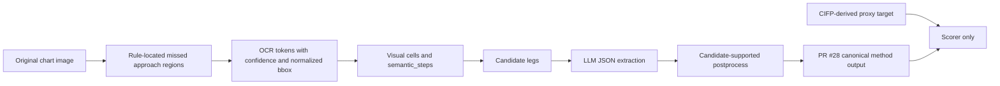

# B3V3 Region-Aware OCR Pilot-10 Result

Date: 2026-04-25

This document summarizes the current B-group pilot experiment for missed-approach extraction. The scope is limited to 10 approach charts and is intended as a reviewable pilot result, not the final 100/300-chart release.

## Scope

The experiment compares chart-derived methods that output the PR #28 `missed_approach_leg_v1` JSON format.

| Method | Input idea | Status |
|---|---|---|
| B1 | Full-page OCR + LLM | Executed on pilot10 |
| B3 | Rule-guided missed-approach region OCR + LLM | Executed on pilot10 |
| B3V2 | Candidate-leg diagnostic variant with richer hints | Executed as diagnostic/reference |
| B3V3 | Strict OCR-only region-aware semantic candidates + LLM + candidate-supported postprocess | Executed and recommended for current B3 route |
| B2 | Human-corrected gold text + LLM | Not executed; gold text is not ready |

The reference target is CIFP-derived proxy JSON. The methods do not read CIFP-derived targets during extraction; targets are used only by the scorer.

## B3V3 Flow

B3V3 is designed to preserve the issue-required no-leakage boundary: prompts do not include CIFP target JSON, expected values, chart-id-like hidden answers, or manual corrected answers.

## Main Result

| Method | Coverage | LegCountAcc | QFieldAcc | Precision | Recall | F1 | ChartExact | ExtraLegs | MissingLegs |
|---|---:|---:|---:|---:|---:|---:|---:|---:|---:|
| B1 | 1.000 | 0.500 | 0.495 | 0.560 | 0.451 | 0.500 | 0.000 | 2 | 4 |
| B3 | 1.000 | 0.200 | 0.344 | 0.422 | 0.310 | 0.357 | 0.000 | 1 | 7 |
| B3V2 | 1.000 | 0.800 | 0.484 | 0.621 | 0.522 | 0.567 | 0.000 | 1 | 1 |
| B3V3 | 1.000 | 0.900 | 0.887 | 0.949 | 0.823 | 0.882 | 0.200 | 2 | 0 |

Final B3V3 per-field exact accuracy:

| Field | Accuracy |
|---|---:|
| Q_terminator | 0.968 |
| Q1_fix_ident | 0.968 |
| Q2_altitude_constraint | 0.871 |
| Q3_turn | 0.935 |
| Q4_course_or_radial | 0.742 |
| Q5_hold_params | 0.839 |

## Validation

The final B3V3 run passed the current pilot gates:

| Check | Result |
|---|---|
| Prompt no-leakage validation | PASS for all 10 B3V3 prompt inputs |
| Bbox normalization validation | PASS, 820 bbox objects checked |
| Method output validation | PASS for all 10 B3V3 outputs |
| PR #28 official schema validation | PASS for all 10 B3V3 outputs |

## Included Result Files

The detailed result package is under `results/pilot_10/b3v3_region_ocr_20260425/`.

| Path | Purpose |
|---|---|
| `evaluation/b1_b3_extended_evaluation.md` | Main B1/B3/B3V2/B3V3 comparison |
| `evaluation/b1_b3_extended_metrics.json` | Machine-readable metrics |
| `evaluation/b1_b3_extended_errors.json` | Machine-readable error details |
| `evaluation/b3v3_final_review_2026-04-25.md` | Final review and remaining-error analysis |
| `method_outputs/*.json` | Final B3V3 method outputs |
| `candidate_legs/*.json` | B3V3 OCR-derived candidate legs |
| `evidence_traces/*.json` | Field-level evidence trace files |
| `reference_targets/*.json` | CIFP-derived proxy targets used only for scoring |
| `schemas/missed_approach_leg.schema.json` | PR #28 schema snapshot used for validation |

## Important Boundaries

This is a pilot-10 result. It should not be described as the final large-scale experiment.

Raw chart PDFs/PNGs, boxed preview images, FAA CIFP source archives, temporary OCR caches, and local credentials are intentionally not included in this submission package.

B2 is not included because the human-corrected gold text input has not been prepared yet.

## Remaining Work

The remaining B3V3 errors are mostly concentrated in course/radial and hold-parameter fields. The next safe optimization is to improve OCR evidence coverage for profile/minima/runway-course context and missed-approach-fix inset regions, rather than manually editing final JSON answers.
